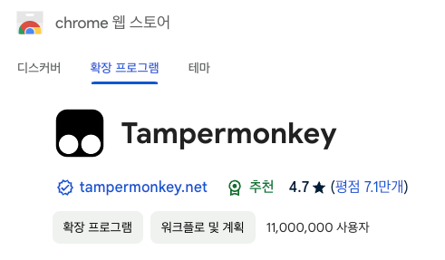
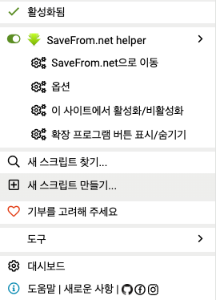
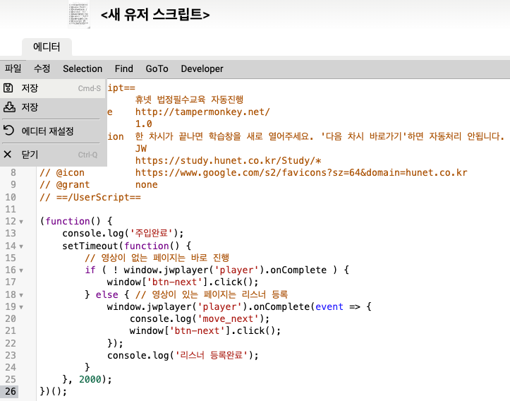

# hunet 의무교육 자동수강

휴넷 의무교육을 켜두기만 하면, 자동으로 끝까지 수강해주는 프로그램 입니다.

## 1. tampermonkey 크롬 앱 설치
- 자바스크립트 function을 주입하기 위해 설치
- https://chromewebstore.google.com/detail/tampermonkey/dhdgffkkebhmkfjojejmpbldmpobfkfo?hl=ko
- 

### 2. 설치 된 앱 아이콘을 클릭하여 “새 스크립트 만들기”
- 

### 3.아래 코드를 붙여넣기 후, 저장

```javascript
// ==UserScript==
// @name         휴넷 법정필수교육 자동진행
// @namespace    http://tampermonkey.net/
// @version      1.0
// @description  한 차시가 끝나면 학습 팝업을 새로 오픈. '다음 차시 바로가기'하면 자동처리 불가
// @author       JUNGWOO
// @match        https://study.hunet.co.kr/Study/*
// @icon         https://www.google.com/s2/favicons?sz=64&domain=hunet.co.kr
// @grant        none
// ==/UserScript==
(function() {
   console.log('주입완료');
   setTimeout(function() {
      // 영상이 없는 페이지는 바로 진행
      if ( ! window.jwplayer('player').onComplete ) {
         window['btn-next'].click();
      } else { // 영상이 있는 페이지는 리스너 등록
         window.jwplayer('player').onComplete(event => {
            console.log('move_next');
            window['btn-next'].click();
         });
         console.log('리스너 등록완료');
      }
   }, 2000);
})();
```
- 

### 4.법정필수교육 열면 자동으로 진행

- 

### 5.참고사항
- 한 차시가 끝나면 학습 팝업을 새로 열어서 진행
- 다음 분기 학습 때,  팝업 URL이 변경되면 코드에서 @match 항목 변경
